# Tutorial: Create a Chatbot with AWS Lex, DynamoDB, and Lambda services
This tutorial takes you through the process of building a serverless AWS Lex Chatbot that will enable the user to check the current weather conditions and forecast for a given city, and then give them the option of entering their personal data for a flight reservation to that city.

The user interface is developed through the AWS Lex service.  An AWS DynamoDB is employed to hold the user's destination city, travel date, and personal data for the reservation request.  AWS Lambda functions (written in Node.js) are employed to retrieve the weather date from the OpenWeather API, and route the user's personal data into the Dynamo database.

# What you will learn

  * How to build a Lex Chatbot UI employing custom intents and slots 
  * How to create a NoSQL DynamoDB to store and retrieve end-user data
  * How to create serverless Lambda functions to pass data into and out of a Lex Chatbot
  * How to upload Lambda Node.js dependency libraries into a Lamba function
  * How to test the functionality of your chatbot within the AWS console  


# Requirements
To follow along with this tutorial all that is required is an AWS account, freely available here: www.aws.amazon.com, and access to the OpenWeather API, which is available through a free subscription here: www.openweathermap.org

While the Serverless (www.serverless.com) Framework was employed to build and deploy the version of the Node.js Lambda function that handle's the API call to the OpenWeather API, you can simply download local copies of the relevant files from this project to follow along with steps of this tutorial.  

A code/text editor will also be useful for following the steps involved in the creation of our first Lambda function, but you can also simply create a local copy of the Lambda function files of this project and follow the steps with those.

# Step 1: Create a DynamoDB table 

For this exercise we are going to use an AWS DynamoDB database to store our user data.  As a NoSQL database, DynamoDB is particularly well suited for this type of task as we need only define a 'primary key' index parameter to hold our users data.  The rest of the parameters we want to store can be added later dynamically.  

The primary key of a DynamoDB is required for each item held.  Additional item attributes can later be added to database on an as-needed bases by pairing the attibute with an index value through JSON.  We do not need to define any additional attributes at this initial stage. We need only decide which user/item attribute will be used for the primary sort index of our database.  In this example I have used last-name for the primary key, denoting only that for a given user to be defined in our database we will need to pass their last name as a parameter into DynamoDB.

To create our database, log into your AWS console, and select DynamoDB from the services menu.

<details><summary>Engage an AWS Service</summary>
<p>
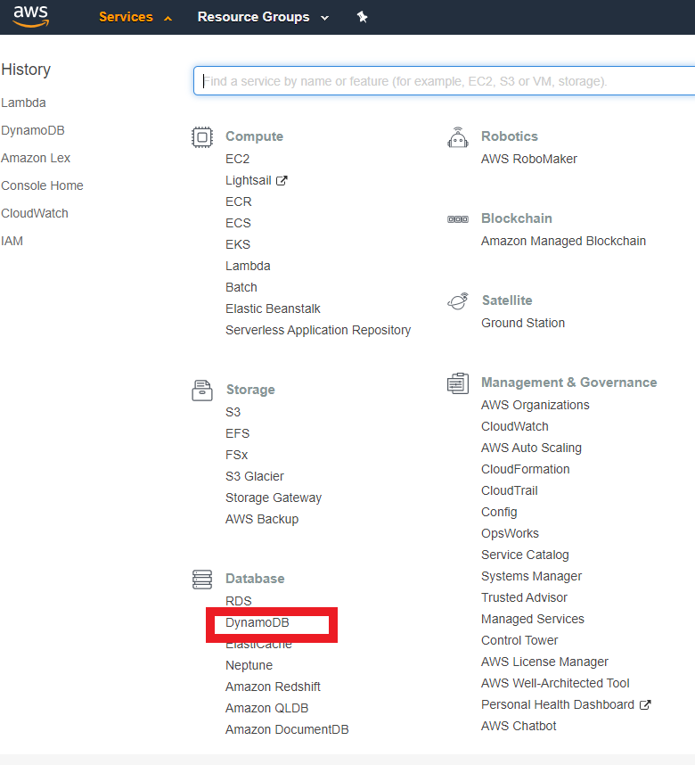
</p>
</details>

From there, select the "Tables" submenu option on the right.  Then click on the "Create Table" button on the main screen.

<details><summary>Create Table</summary>
<p>
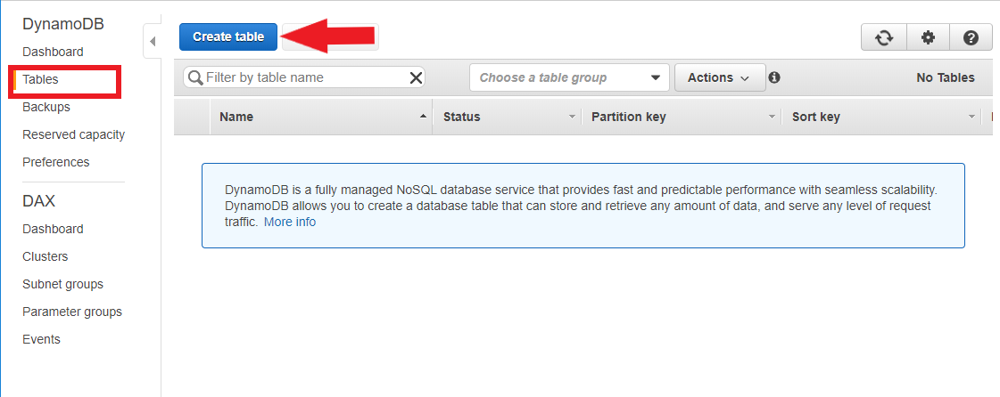
</p>
</details>

On the table creation screen, enter names for your table and primary key.  Use "string" for your primary key data type. And use the default settings for your table's creation. 

<details><summary>Set DynamoDB Table Options</summary>
<p>
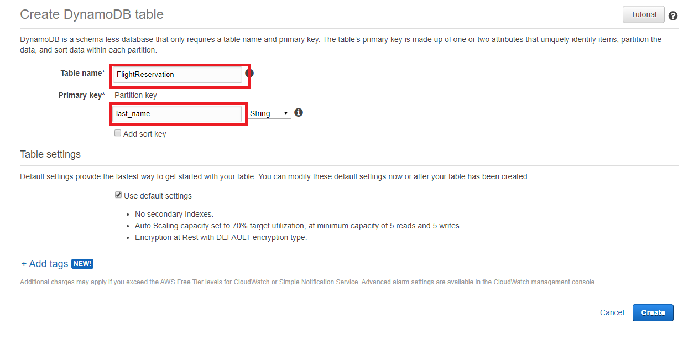
</p>
</details>

Once you have created your table, we have completed everything necessary for the task of building a queryable database repository of user data for making flight reservations.  All you need to do is note the names you used for your table and key. Your table name will be used later in the creation of the Lambda function that will pass the user data into this database.  Your primary key name will be used in the next section when we create our when we create the intent slots for our Lex chatbot.

# Step 2: Create a Chatbot

Now we need to create a user interface that will elicit our user data.  To do this will we will create a Lex chatbot.  The AWS Lex service will allow us to quickly create a user interface that we can use for both voice and text interactions with our users.  What follows is intended to demonstrate how we can easily both pull information into a Lex chatbot (through an external API call), as well as push data out to DynamoDB. 

To get started with the creation of our Lex chatbot, select Lex from the services menu, then on the initial screen select the option to 'Create' under the main screen.  

On the "Create your bot" page, select the "custom bot" option at the top.  To complete your initial bot creation you will need to:

  1. Name your bot
  2. Choose an Output voice for your bot
  3. Choose a session timeout duration (how long the bot waits for input before restarting a session)
  4. Indicate whether the bot is to be subject to the COPPA Act

<details><summary>Set Bot Creation Options</summary>
<p>
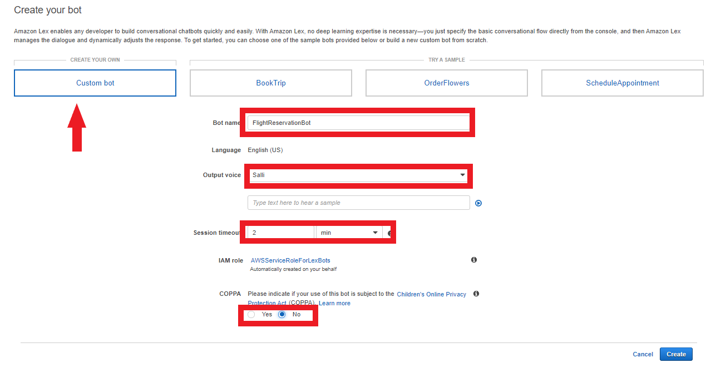
</p>
</details>

# Step 3: Create a bot Intent

After you have created your bot, you should see the 'Editor' tab of the main page for your bot, as shown here.


As indicated by this screen, the primary thing we now need to do to set up our bot is to create its *intents*.  As you can also tell from this screen, *intents* are the things that user can do with our bot.  Becaue I want to demonstrate the ease with which we can both pull information into, as well as push information out of, our bot it will be userful to define two different things that our users will be able to with our bot.  Namely:


  * Intent 1: Check the weather for a given city
  * Intent 2: Enter their information for flight reservation to a city

We can start off creating these intents by clicking on the "Create Intent" button on the editor tab, and then selecting "create intent" again on the following pop-up menu, and then giving our first intent a name.  Once we have named our intent, we are automatically taken to the editor for the intent.

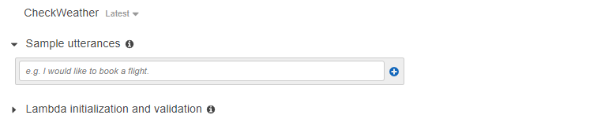

For this tutorial, we will not be using an initialization Lambda function. We will assume the user engages our application as an authorized user knowing its purpose, namely allowing them to check weather and make flight reservations.  However we do need to specify some initial *utterances.

A Lex utterance is the verbal or typed input that lets our bot know which of our intents (the things our bot can do) the user wants to engage with.  To activate the intent for checking the weather, we need to specify what kinds of input a typical user would use to let someone know they want a weather forecast, such as "Check weather"  

Additionally, we should keep in mind when creating our bot that a given user will typically want to start off their interaction with our application by checking the weather for a given city first, before they book a flight there.  Because of this, in addition specifying utterances like "Check the weather", and "Get forecast", we also may wish to include some simple introductory phrases, such as "Hello". Each of these utterances should be entered as a seperate line, and then added to the list of intent activators by clicking on the "+" mark.

<details><summary>Add Utterance to an Intent</summary>
<p>
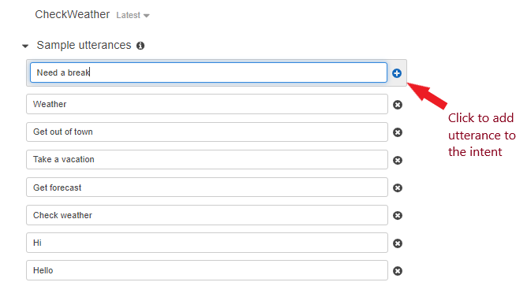
</p>
</details>
 
Now that we have specified the utterances that let's our bot know which of our two intents that our user wants to use (namely to get a weather forecast for a particular city, we need to define precisely what information the user needs to give us to fulfill this intent. **Slots** define the information that is needed from the user to fulfill the intent.  For our current intent, the necessary information we need to gather from the user is the *city* they are interested in.  Once we have that information, we can return to the user the weather forecast for the city they are interested in traveling to.  You create slots by naming them, defining their data type, and associating them with a specific information request in Intents editor's slot section, shown here:

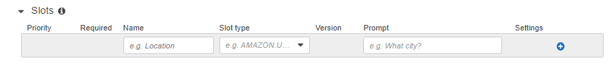

The slot name can be of your choosing, for this I simply use "city".  For the type, there is a pre-populated pull-down menu of options defined by Amazon. This aids with potential formatting issues that might arise when passing the value into other applications and data sources. For this example, you should simply choose the "US_CITY" type.  The question prompt is also a matter of choice, as it need only be something that is reasonably certain to get an appropriate response from the user.  In our case something along the line of "What city are you interested in?" should suffice to get an appropriate respones. 

After filling in these three fields, click on the "+" symbol to add the slot to the intent.
 
<details><summary>Add Slot to an Intent</summary>
<p>
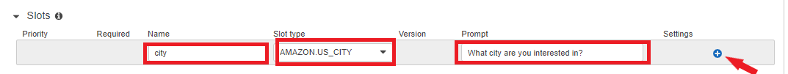
</p>
</details>

# Step 4: Build and test your chat bot

After you have added your slot to the intent and saved the intent, you are ready to create the initial test build of your chat bot and test its functionality.  The test build is created by selecting the build button at the top editor.  Once the build is completed, you should test your bot by typing some text into the test dialog box to see how it will respond to sample user input.

<details><summary>Create a Test bot build</summary>
<p>
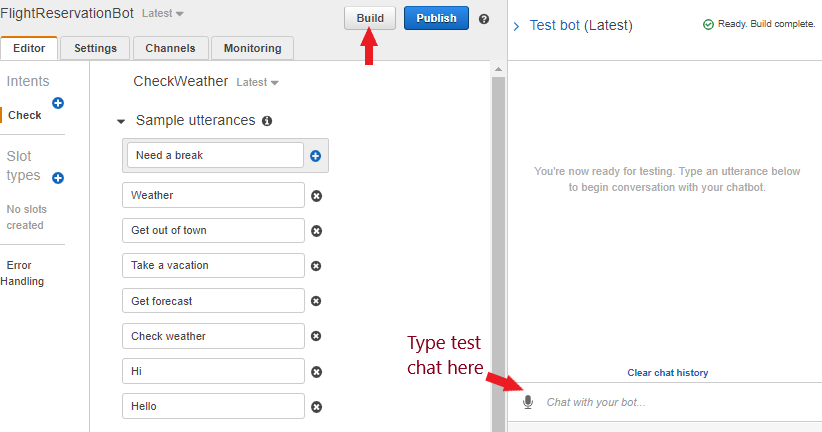
</p>
</details>

You should test your bot using utterances close to your defined utterances, but with small variations.  The built-in AI capabilities of the Lex bot builder should be able to detect utterances similar enough to the specified ones to that small variations shouldn't matter. 

The response that you want to elicity with input similar to your initially specified utterances is the question defined in your slot.  The slot question response should assure your bot will get the information needed to fulfill the intent.  Given that we have not yet specified how the bot should fulfill this intent, at this stage a successful test should return a notification that the intent is **ready for fulfillment**.  A successful test should look something like the following.

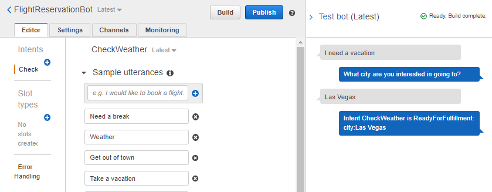

If your initial text submission does not elicit your slot question, you should add it to your list of utterances.

Before moving to the fulfillment of our intent through a Lambda function, test your bot with the following input: *Want a vacation to Las Vegas*

Here our initial utterance already provides the information needed to fulfill the intent, but our bot doesn't realize it.  This is because the bot has not yet learned to look for slot value in an initial triggering utterance.  It is only primed to look for the slot value in response to the slot question. 

To handle this situation we need to create sample utterances that reference our slot, which tells our bot that the intent may already already have the information it requires in the initial utterance, without the prompt defined in our slot definition. To let Lex know how our slot value may occur in an utterance, we can simply create a sample utterance with the slot name ("city" in our example) in "{}" in the utterance--for example: "Need a vacation to {city}".

<details><summary>Referance a slot in an utterance</summary>
<p>
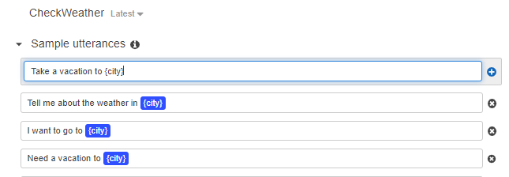
</p>
</details>

Once you have added some utterances that reference your slot to your intent, you should save your intent again, rebuild your bot, and then test it again with "Want a vacation to Las Vegas".  This time you should see the response "Ready for fulfillment" returned.  This tells you that the slot value will be immediately passed to our Lambda function without the need for a response to question put in out slot question.

# Step 5: Fulfill your Intent with a Lambda function

Below the slot definition of the intent, you will find the "Fulfillment" section for our intent, and the radio button option for the option of calling a Lambda function to fulfill the intent.  


By selecting the Lambda function option, we ensure that the a Lambda function will be called by the "Ready for Fulfillment" condition returned when our intent has the information it needs.  However, we can't select this option yet.  We first need to create the function. To do this, we will be using Node.js, though it is worth noting that a variety of other languages can be used.  I am using Node.js simply because the function is a little cleaner in its implementation regarding what is actually going on.

```javascript

{
  "messageVersion": "1.0",
  "invocationSource": "DialogCodeHook",
  "userId": "myUserId",
  "sessionAttributes": {},
  "bot": {
    "name": "myBotName",
    "alias": "$LATEST",
    "version": "$LATEST"
  },
  "outputDialogMode": "Text",
  "currentIntent": {
    "name": "myIntentName",
    "slots": {
      "mySlotName": "mySlotValue"
    },
    "confirmationStatus": "None"
  }
}
```
