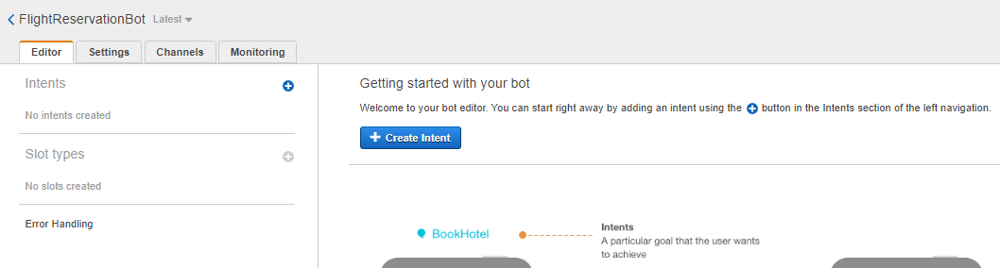

# Tutorial: Create a Chatbot with AWS Lex, DynamoDB, and Lambda services
This tutorial takes you through the building of a serverless AWS Lex Chatbot that will enable a user to check the current weather  for a given city, and then enter their personal data for a flight reservation to that city.

The user interface is developed through the AWS Lex service.  An AWS DynamoDB is deployed to hold the user's destination city, travel date, and personal data for the reservation request.  AWS Lambda functions (written in Node.js) are employed to retrieve a city's weather forecast from the OpenWeather API, and then route the user's personal data into the Dynamo database for a flight reservation to that city.

# What you will learn

  * How to create a NoSQL DynamoDB and use it as a repository for end-user data
  * How to build a Lex Chatbot UI employing custom intents and slots 
  * How to create serverless Lambda functions to pass data into and out of a Lex Chatbot
  * How to upload Lambda Node.js dependency libraries into a Lambda function
  * How to test the functionality of your chatbot within the AWS console  


# Requirements
To follow along with this tutorial you will need an AWS account, freely available here: www.aws.amazon.com, and access to the OpenWeather API, which is available by way of a free subscription here: www.openweathermap.org

While I used the Serverless (www.serverless.com) Framework to build and deploy the versions of the Node.js Lambda functions discussed below, this framework is not covered in this tutorial as is not needed to follow the steps in this tutorial.  You can simply download local copies of the relevant javascript files from this project and use them to follow along with steps of this tutorial, or you can rebuild scripts with editor of your choice. Note,  however, you will need the dependency node files in the nodes module of the WeatherAPICall folder above to deploy and run your script in Lambda.

# Step 1: Create a DynamoDB table 

The first step we will perform is the creation of an AWS DynamoDB database to store our user's flight reservation data.  As a NoSQL database, DynamoDB is particularly well suited for this type of task as we need only define a 'primary key' index parameter to hold our users data.  The rest of the parameters we want to store can be added later dynamically simply by adding objects that possess additional attributes.  

The primary key attribute for a DynamoDB is required for each item it holds.  To create our DynamoDB we need only decide on an attribute each of our items (in our case--users) will have.  In this example I have used 'last-name' for the primary key.

To create our database, log into your AWS console, and select DynamoDB from the services menu.

<details><summary>Engage an AWS Service</summary>
<p>

</p>
</details>

From there, select the "Tables" submenu option on the right.  Then click on the "Create Table" button on the main screen.

<details><summary>Create Table</summary>
<p>

</p>
</details>

On the table creation screen, enter names for your table and primary key.  Use "string" for your primary key data type. And use the default settings for your table's creation. 

<details><summary>Set DynamoDB Table Options</summary>
<p>

</p>
</details>

Once you have created your table, we have completed everything necessary for the task of building a queryable database repository of user data.  We will need to keep track of our table name and primary key, as they will be used later in building our chat bot and Lambda functions.

# Step 2: Create a Chatbot

Our next step is to create the user interface that will interact with our users and collect the data for their reservation.  To do this will we will use the AWS Lex chatbot service.  This will allow us to quickly create a user interface that we can use for both voice and text interactions with our users.  

In designing this Lex chatbot, I have attempted to demonstrate the ease with which the Lex chatbot interface allows us to both pull information into a Lex chatbot (through an external API call), as well as push data out to DynamoDB. 

To get started, select Lex from the services menu, then on the initial screen select the option to 'Create' under the main screen.  

On the "Create your bot" page, select the "custom bot" option at the top.  To complete your initial bot creation you will need to:

  1. Name your bot
  2. Choose an Output voice for your bot
  3. Choose a session timeout duration (how long the bot waits for input before restarting a session)
  4. Indicate whether the bot is to be subject to the COPPA Act

<details><summary>Set Bot Creation Options</summary>
<p>

</p>
</details>

With these options set you can go ahead and create your bot.

# Step 3: Create a bot Intent

After you have created your bot, you should see the 'Editor' tab of the main page for your bot, as shown here.



As you can see, the first thing we now need to do to make our bot functional is to create its *intents*.  As noted on the Lex editor page:

*Lex Intent*: something the user can do with a bot  

Becaue I want to demonstrate the ease with which we can both pull/push data to/from our bot, it will be userful to define two different sorts of things our users can do with our bot.  Namely:

  * Intent 1: Check the weather for a given city
  * Intent 2: Enter their information for flight reservation to a city

Creating each of these intents is a seperate step in our build process.  In the remainder of this step we will concentrate on building the first intent--checking the weather for a given city.  To accomplish this, start by clicking the "Create Intent" button on the editor tab, and then selecting 'create' (rather than 'import') on the following pop-up menu. Following that, give the intent a name (I have used "CheckWeather").  Once intent is named and created, we are taken to its editor.


Here you can see entry parameters for defining *utterances, an initialization, and slots*. For this tutorial, we will not be using an initialization function. We will assume the user came to our application as an authorized user knowing its purpose, namely allowing one to check weather forecasts and make flight reservations.  However one always needs to specify *utterances* and at least one *slot* for an intent.

*Lex Utterances*: an utterance is an example of a user input (voice or text) that should start an intent
*Lex Slot*: a slot defines the type of information your bot needs to fulfill an intent

A Lex utterance is the verbal or typed input that lets our bot know which of our intents the user wants.  To activate the intent for checking the weather, we need to specify what kinds of things a user would say or type when they want to check the weather, for example: "Check weather", "Get forecast", "What's the temperature", etc.  You should always supply multiple potential utterances.  The more you specify, the better Lex's built-in AI will be able to determine that a given unspecified input, such as "How hot is it?" is an appropriate activating utterance for out intent.  

Additionally, we should keep in mind when creating our bot that a given user will typically want to start off their interaction with our application by checking the weather for a given city first, before they book a flight there.  So the CheckWeather intent is a good intent to use for your default intent. A default intent can be created by simply using introductory phrases, such as "Hello" as part of the intent's sample utterances. 

Each of these utterances should be entered as a seperate line, and then added to the list of intent activators by clicking on the "+" mark.

<details><summary>Add Utterance to an Intent</summary>
<p>

</p>
</details>
 
With the activating utterances specified, we need to define precisely what information the user needs to provide to fulfill this intent. This is what is defined in the *slot* parameter's definition.  For our current intent, the necessary information we need to gather from the user is the *city* they are interested in.  Once we have that information, we know which weather forecast to retrieve for them.  

You create slots by naming them, defining their data type, and associating them with a specific information request in editor's slot section, shown here:


The slot name can be of your choosing, for this I simply use "city".  For the type, there is a pre-populated pull-down menu of options defined by Amazon. This aids with potential formatting issues that might arise when passing the values. For this example, you should simply choose the "US_CITY" type.  The question prompt is also a matter of choice, as it need only be something that is reasonably certain to get the needed data from the user.  In our case something along the line of "What city are you interested in?" should suffice. 

After filling in these fields, click on the "+" symbol to add the slot to the intent.
 
<details><summary>Add Slot to an Intent</summary>
<p>

</p>
</details>

# Step 4: Build and test your chat bot

After you have added your utterances and slot to the intent, save it.  You are then ready to create the a test build of your chat bot and test its functionality.  The test build is created by selecting the *build* button at the top editor.  Once the build is completed, you test your bot by typing input text into the test dialog box, and viewing the bot's responses.

<details><summary>Create a Test bot build</summary>
<p>

</p>
</details>

You should test your bot using utterances close to your defined utterances, but with small variations.  The built-in AI capabilities of the Lex bot builder should be able to detect utterances similar enough to the specified ones to that small variations don't matter. 

The response that you want to elicit with your test at this point is the bot reaching a **ready for fulfillment** state. This signifies that the bot believes it has information necessary to complete the intent.  A successful test should look something like the following.


If your initial text submission does not elicit your slot question, you should add it to your list of utterances.

# Step 5: Add a slot-referencing utterance to your Intent

Before moving to the fulfillment stage of build, first test your bot with the following input: *Want a vacation to Las Vegas*

Here our initial utterance already provides the information needed to fulfill the intent, but our bot doesn't realize it.  This is because the bot has not yet learned to look for the slot value in an utterance.  It is only primed to look for the slot value in response to the slot question. 

To enable the bot to handle this situation correctly, we need to create sample utterances that reference our slot. This tells our bot that the intent may already already have the information it requires in the initial triggering utterance.  As such there is no need to  prompt for the slot value with slot question. 

To let Lex know how our slot value may occur in an utterance, we can simply create a sample utterance with the slot name ("city" in our example) in "{}" in the utterance--for example: "Need a vacation to {city}".

<details><summary>Referance a slot in an utterance</summary>
<p>

</p>
</details>

Once you have added some utterances that reference your slot, save your intent again, rebuild your bot, and then test it again with "Want a vacation to Las Vegas".  

This time you should see the response "Ready for fulfillment" immediately returned.  

# Step 6: Build a function to fulfill your intent

Below the slot definition of the intent, you will find the "Fulfillment" section for our intent, and the radio button option for using a Lambda function for the fulfillment stage.  


Selecting the Lambda function option tells Lex to call the Lambda function once it has reached the the "Ready for Fulfillment" state. However, selecting the Lambda function option for fulfillment at this point won't get us very far.  We first need to create the Lambda function. 

To do this, we will be using Node.js, though it is worth noting that a variety of other languages can be used.  I use Node.js here simply because the function is a little cleaner in its implementation regarding what it is actually doing.  But before we move to our function's construction, it is first worth pausing to note what is passed into to our Lambda  in terms of the JSON name/value pairs:

*Lex output to Lambda

```python

{
  "messageVersion": "1.0",
  "invocationSource": "DialogCodeHook",
  "userId": "myUserId",
  "sessionAttributes": {},
  "bot": {
    "name": "myBotName",
    "alias": "$LATEST",
    "version": "$LATEST"
  },
  "outputDialogMode": "Text",
  "currentIntent": {
    "name": "myIntentName",
    "slots": {
      "mySlotName": "mySlotValue"
    },
    "confirmationStatus": "None"
  }
}
```
Aside from being able to use this to construct test events for our Lambda function, examining the format of what is being passed into our function tells us how we can pull the value of interest to us (the slot value) out of it. Namely, by way of reference to the slots parameter of the currentIntent:

 **currentIntent.slots.mySlotName**  
 
Recall, also, that for us, the slot value of interest is a city name.  Once we have the city name, we can actually just pass that into an API call that will return will return the weather conditions and forecast for our city of interest.  We then construct a repository for the data returned by the API response.  Finally we construct a statement to return to our Lex bot that is built out of the data in our API response repository.  

We can achieve all of this in Node.js with just the following:
 
```javascript

  const city = event.currentIntent.slots["city"];
  const url = "http://api.openweathermap.org/data/2.5/weather?q=" + city + "&units=imperial&APPID=e9ae370e1961e718702dd3295e97da23";

  try {
    const response = await axios.get(url);
    const data = response.data;

    const answer = "The temperature is " + data.main.temp + "degrees and Humidity is " + data.main.humidity + "% with " + data.weather[0].description + " expected. Would you like to make a flight reservation to this city?";
    
```
This is all that it takes to codewise to build the response that we want to return to lex.  We are not done with our function yet, how we still need to package our "answer" in a form that will be accessible to Lex.  But before constructing our Lex response, there are a immediately a couple of things worth noting about our function so far. 

First, to implement this tutorial on your **you will need to replace the APPID above with your own** (freely available OpenWeather as noted at the beginning of this tutorial).

Second, the above code relies on the *axios* node addition to the standard javascript library.  This entails some additional work will be needed on our part when implementing this code in AWS Lambda, which we will detail below.

Now to complete our function we need to construct the response we will return to Lex.  This can be accomplished with the following code:

```javascript

return {
      "sessionAttributes": {},
      "dialogAction": {
        "type": "Close",
        "fulfillmentState": "Fulfilled",
        "message": {
          "contentType": "PlainText",
          "content": answer
        }
```
The return function embeds the JSON format that responses to Lex will generally need to take. The "type" and "fulfillmentState" parameters here are simply telling Lex that with this data our intent has become fulfilled and can move to a closed state.  The bulk of the work being done here is by way of simply passing the 'answer' constructed in the first part of our function into Lex by way of the 'content' parameter.

The only remaining bits our function now requires is an invocation of the axios library, the construction of handler that calls the main function when data is passed into it from Lex, and an error condition check.  The full text of the script we need is as follows:

```javascript

'use strict';

const axios = require("axios");

module.exports.getWeather = async (event) => {
  const city = event.currentIntent.slots["city"];
  const url = "http://api.openweathermap.org/data/2.5/weather?q=" + city + "&units=imperial&APPID=e9ae370e1961e718702dd3295e97da23";

  try {
    const response = await axios.get(url);
    const data = response.data;

    const answer = "The temperature is " + data.main.temp + "degrees and Humidity is " + data.main.humidity + "% with " + data.weather[0].description + " expected. Would you like to make a flight reservation to this city?";
    
    return {
      "sessionAttributes": {},
      "dialogAction": {
        "type": "Close",
        "fulfillmentState": "Fulfilled",
        "message": {
          "contentType": "PlainText",
          "content": answer
        }
      }
    }
  } catch (error) {
    console.log(error);
  }
};
```


# Step 7: Build your Lambda function


<details><summary>Specify Lambda Function Parameters</summary>
<p>

</p>
</details>


<details><summary>Upload Package To Lambda</summary>
<p>

</p>
</details>


# Step 8: Test your Lambda function


# Step 9: Add your Lambda function to your Intent

<details><summary>Add a Lambda function to an Intent</summary>
<p>

</p>
</details>


# Step 10: Create your 2nd Intent


# Step 11: Create your DynamoDB Lambda Function

```javascript

console.log('Loading event');
var AWS = require('aws-sdk');
var dynamodb = new AWS.DynamoDB({apiVersion: '2012-08-10'});
var tableName = "FlightReservation";

function storeReservation(intent, callback) {
	
	 let userInfo = {};

    Object.keys(intent.currentIntent.slots).forEach((item) => {
        console.log(item)
        userInfo[item] = {"S": intent.currentIntent.slots[item]};
    });

    
    dynamodb.putItem({
        "TableName": tableName,
        "Item" : userInfo
    }, function(err, data) {
        if (err) {
            console.log('Failure storing user info');
            console.log(err);
            callback(close(intent.sessionAttributes, 'Fulfilled',
            {'contentType': 'PlainText', 'content': "I am sorry, but something went wrong saving your Registration Info. Please try again."}));
        } else {
            console.log("Successfully Stored UserInfo");
            callback(close(intent.sessionAttributes, 'Fulfilled',
            {'contentType': 'PlainText', 'content': "Thank you for using us to make your reservations."}));
        }
    });
}

function close(sessionAttributes, fulfillmentState, message) {
    return {
        sessionAttributes,
        dialogAction: {
            type: 'Close',
            fulfillmentState,
            message,
        },
    };
}
exports.handler = (event, context, callback) => {
    console.log(event);
    try {
        storeReservation(event,
            (response) => {
                callback(null, response);
            });
    } catch (err) {
        callback(err);
    }
};
```

# Step 12: Add your DynamoDB function to your Bot and test


